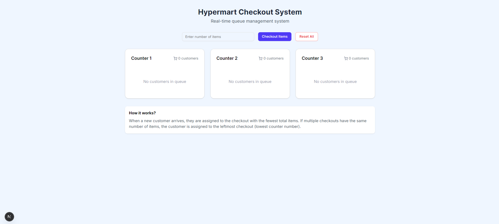

# Hypermart Checkout System

A real-time queue management system for optimizing customer checkout experiences in supermarkets and retail stores.



## Overview

The Hypermart Checkout System is a modern web application designed to efficiently manage checkout queues in high-traffic retail environments. The system automatically assigns customers to checkout counters with the fewest total items, reducing wait times and improving overall shopping experiences.

## Features

- **Smart Queue Assignment**: Automatically directs customers to the checkout counter with the fewest total items
- **Real-time Updates**: Visual feedback when customers are assigned to counters
- **Queue Monitoring**: Tracks the number of customers and items at each checkout counter
- **Simple Management**: Easy-to-use interface for adding customers and resetting counters
- **Responsive Design**: Works seamlessly across desktop and mobile devices

## Tech Stack

- **Framework**: Next.js 15.3.2
- **UI**: React 19.0.0
- **Styling**: Tailwind CSS 4.1.5
- **Icons**: Lucide React
- **Components**: Custom UI components using Radix UI primitives

## Getting Started

### Prerequisites

- Node.js (v18 or higher)
- npm or yarn

### Installation

1. Clone the repository:
   ```bash
   git clone https://github.com/yourusername/hypermart-checkout-system.git
   cd hypermart-checkout-system
   ```

2. Install dependencies:
   ```bash
   npm install
   ```
   or
   ```bash
   yarn install
   ```

3. Run the development server:
   ```bash
   npm run dev
   ```
   or
   ```bash
   yarn dev
   ```

4. Open [http://localhost:3000](http://localhost:3000) in your browser to see the application.

## Usage

1. **Adding a Customer**:
   - Enter the number of items in the input field
   - Click "Checkout Items" to assign the customer to the optimal counter
   - The assigned counter will briefly highlight in green

2. **Resetting the System**:
   - Click "Reset All" to clear all counters and start fresh

## How It Works

The system implements a simple but effective algorithm for queue management:

1. When a new customer arrives, they are assigned to the checkout counter with the fewest total items
2. If multiple counters have the same number of items, the customer is assigned to the counter with the lowest number (leftmost counter)
3. Each counter keeps a running total of customers and items

This approach helps balance the workload across all checkout counters and minimizes customer wait times.

### Adding More Counters

To increase the number of checkout counters:

1. Open `app/page.tsx`
2. Update the initial state in the `useState` hook:
   ```typescript
   const [checkouts, setCheckouts] = useState<Checkout[]>([
     { id: 1, customers: [], totalItems: 0 },
     { id: 2, customers: [], totalItems: 0 },
     { id: 3, customers: [], totalItems: 0 },
     { id: 4, customers: [], totalItems: 0 }, // Add more counters as needed
   ])
   ```
3. Don't forget to also update the `resetCheckouts` function to include the same number of counters.

## Acknowledgments

- UI components inspired by [shadcn/ui](https://ui.shadcn.com/)
- Icons provided by [Lucide](https://lucide.dev/)